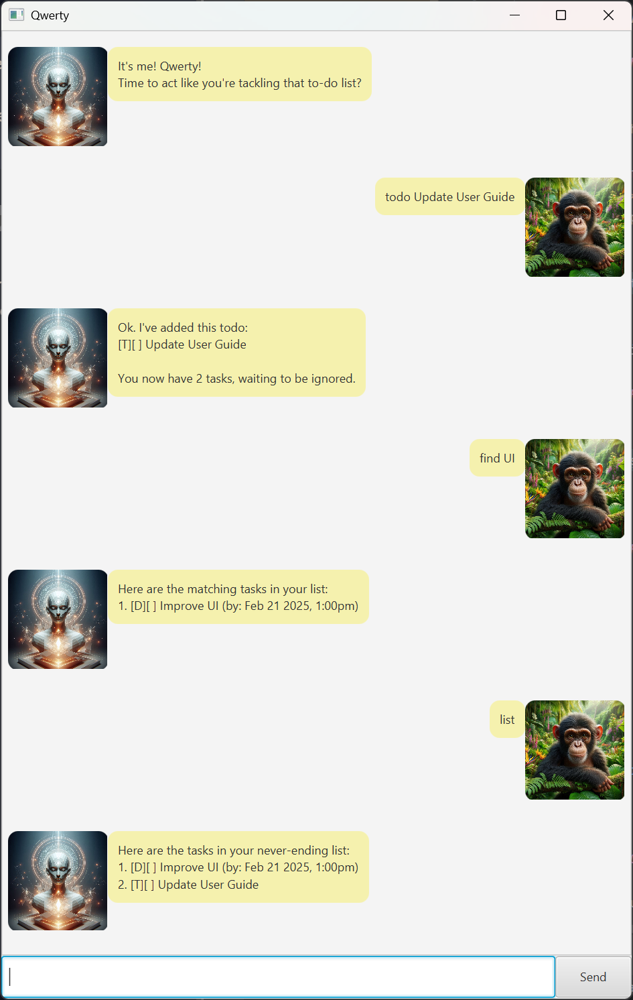

# Qwerty User Guide

Welcome to Qwerty, the cheeky little task and loan manager that’ll help you keep track of everything on your todo list — from deadlines to events, and even loans (because we all know that *one* person who *always* forgets what they owe). It's easy to use, looks simple, but packs a punch when it comes to keeping you organised.

---

## Where to Download

You can grab Qwerty from the GitHub releases page:

- **Download the JAR file**: [Qwerty.jar](https://github.com/weien02/ip/releases)
    - Click the file and away you go!

If you’re feeling a bit more adventurous, you can clone the repo and build it yourself. Here’s how:

### Clone the Repository

```bash
git clone https://github.com/weien02/ip.git
cd ip
```

### Build and Run

Once you're in the project directory, run this to build and launch Qwerty:

```bash
./gradlew run
```

---
## Screenshot


---

## How to Use Qwerty?

Once Qwerty’s up and running, it’s all about those nifty commands. Here’s the rundown:

### Commands

- **list**: See all your current tasks, laid out nice and simple.

  ```text
  list
  ```

- **todo {desc}**: Add a To-Do task. Just pop in a description of what you need to do. It’s as easy as pie!

  ```text
  todo Buy groceries
  ```

- **deadline {desc} /by {yyyy-MM-dd HHmm}**: Got a deadline? No worries, just add your task with a due date and time in this format: `yyyy-MM-dd HHmm`.

  ```text
  deadline Finish homework /by 2025-02-20 1800
  ```

- **event {desc} /from {start} /to {end}**: Got an event coming up? Whether it’s a meeting or a birthday party, add it here with the start and end times.

  ```text
  event Recess Week /from 22 February /to 2 March
  ```

- **loan {desc} /from {loaner} /to {loanee}**: Need to track a loan? Whether it’s money, books, or a DVD that’s probably never coming back, add it here.

  ```text
  loan $1000 /from me /to Alice
  ```

- **find {desc}**: Searching for something? This will find all tasks with the description containing the word(s) you’ve entered.

  ```text
  find homework
  ```

- **mark {index}**: Finished something? Mark it as done, and feel smug about it.

  ```text
  mark 1
  ```

- **unmark {index}**: Oh no, made a mistake? Unmark it and start again.

  ```text
  unmark 1
  ```

- **delete {index}**: If something’s no longer needed, you can delete it with this command.

  ```text
  delete 3
  ```

- **bye**: Saying goodbye? Let Qwerty know you’re off. It won’t be offended.

  ```text
  bye
  ```

---

## Links

- **Project Repo**: Check out the codebase on the [GitHub repo](https://github.com/weien02/ip).
- **Issues**: Found a bug or have an idea for improvement? Report them in [GitHub Issues](https://github.com/weien02/ip/issues).

Happy tasking! 🤖✨

---
